# myst

## Overview 
**Caption:** *A real-time recording of me creating a kitchen scene using Stable Diffusion and Dust3r.*

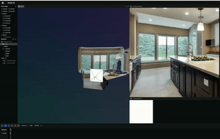

**Architecture:** *Showing how we created these worlds.*

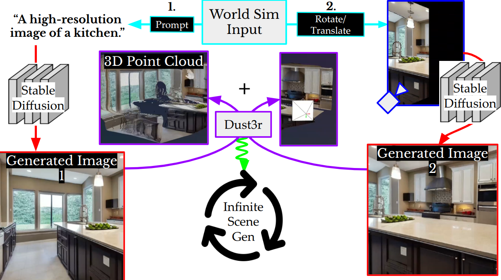
---

## A Few Scenes 
<table>
  <tr>
    <td align="center">
      <strong>LOTS of bay windows..</strong> 
      
    </td>
    <td align="center">
      <strong>What happens in a long hallway?</strong> 
      
    </td>
    <td align="center">
      <strong>Monastery tunnels</strong> 
      
    </td>
  </tr>
  <tr>
    <td align="center">
      <strong>Full 360 beach views</strong> 
      
    </td>
    <td align="center">
      <strong>Kitchen meets a fireplace</strong> 
      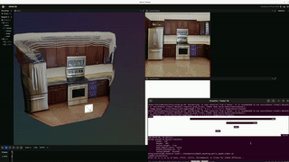
    </td>
    <td align="center">
      <strong>Nice wood oak paneling</strong> 
      
    </td>
  </tr>
  <tr>
    <td align="center">
      <strong>Super mario kitchen-land</strong> 
      
    </td>
    <td align="center">
      <strong>Severance hallway?</strong> 
      
    </td>
    <td align="center">
      <strong>More beach and ocean views</strong> 
      
    </td>
  </tr>
  <tr>
    <td align="center">
      <strong>Spacious bedroom kitchens</strong> 
      
    </td>
    <td align="center">
      <strong>Fireplace bedroom kitchens</strong> 
      
    </td>
    <td align="center">
      <strong>Interesting ceilings</strong> 
      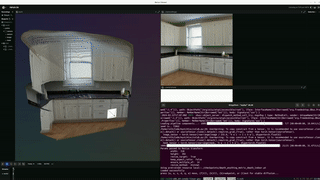
    </td>
  </tr>
</table>

## Synthetic Dataset 

Myst is a combination of Stable Diffusion and Dust3r/DepthAnything to create 3D worlds that are 3D aware and go beyond outpainting. 

We can create infinite 3D scenes, for use as a potential dataset. Besides manually creating these worlds, we can also do it automatically.

**Automatic Dataset:** *Showing a few automatic datasets.*

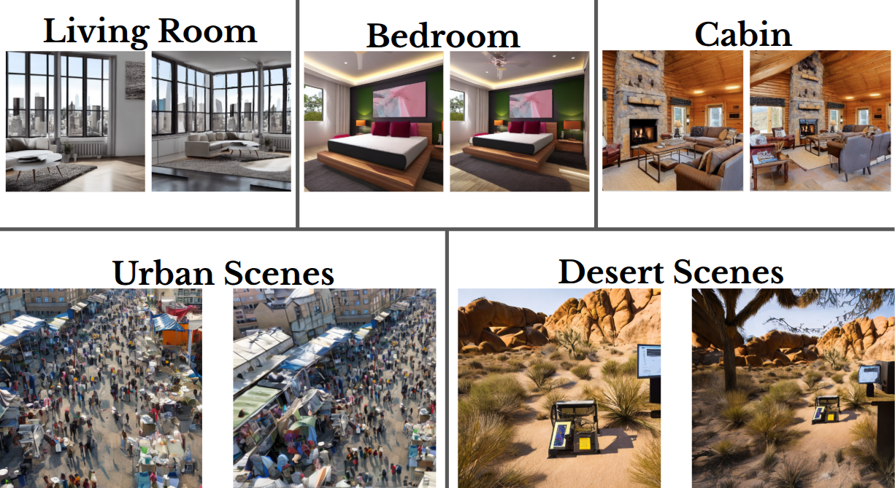

<table>
  <tr>
    <td align="center">
      <strong>Urban spook</strong> 
      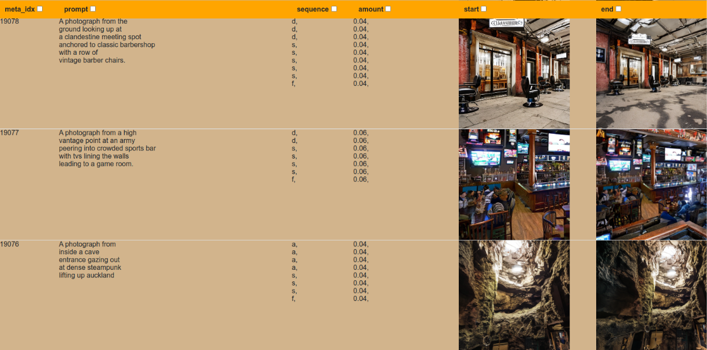
    </td>
    <td align="center">
      <strong>Mountains and ducks</strong> 
      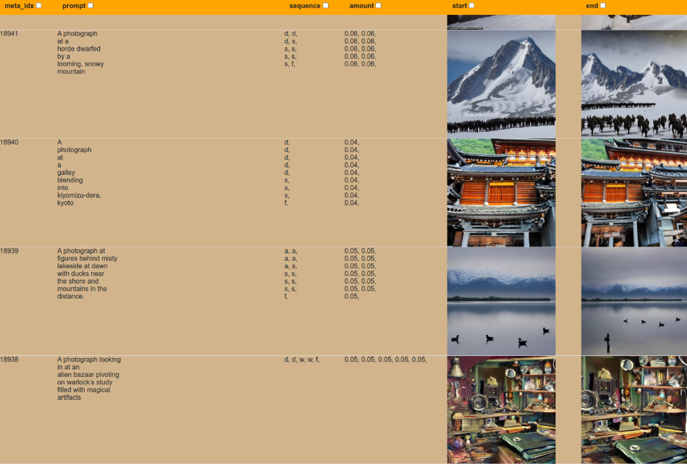
    </td>
  </tr>
  <tr>
    <td align="center">
      <strong>Marble, books, plants</strong> 
      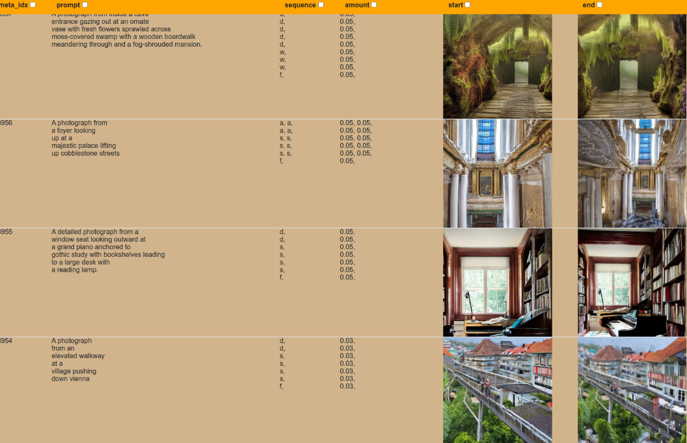
    </td>
    <td align="center">
      <strong>Buddha, cape town, aerial</strong> 
      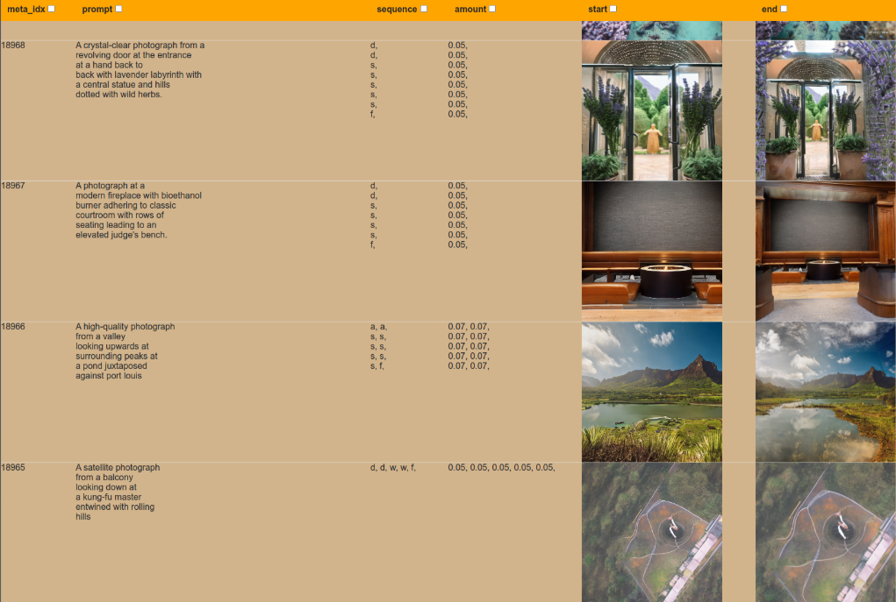
    </td>
  </tr>
  <tr>
    <td align="center">
      <strong>Venice and ruins</strong> 
      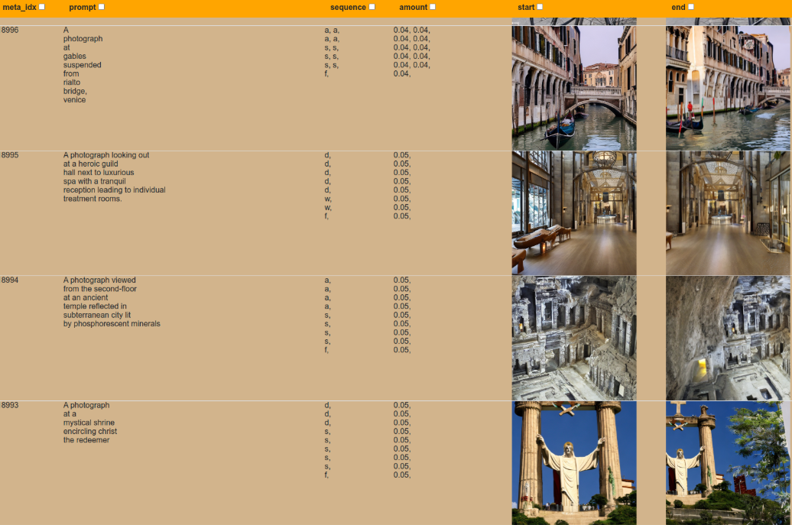
    </td>
    <td align="center">
      <strong>More kitchens</strong> 
      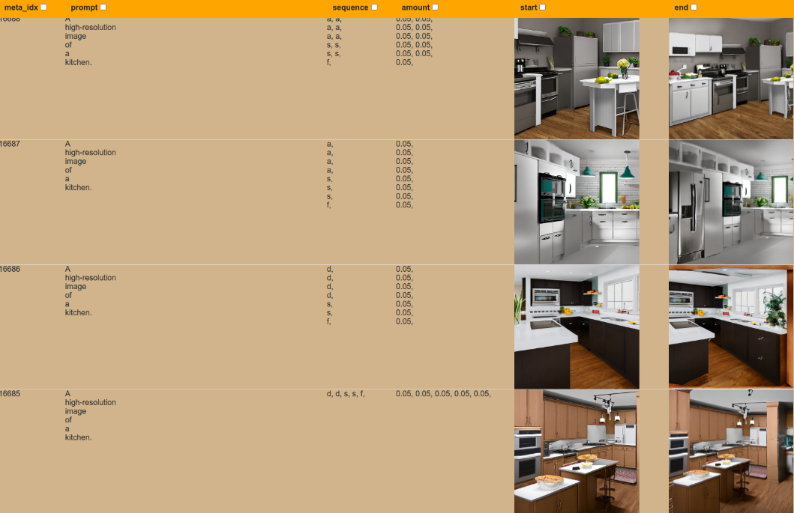
    </td>
  </tr>
</table>

## Install
`mamba install -y pytorch torchvision torchaudio pytorch-cuda=12.1 diffusers xformers pytorch3d -c pytorch -c nvidia -c pytorch3d -c conda-forge`

## Run
`python run.py`
