# myst

Myst is a combination of Stable Diffusion and VGGT (Visual Geometry Grounded Transformer)/DepthAnything/Metric3D to create worlds that are 3D aware and go beyond outpainting.

Simply, Myst lets you start with a text prompt, "an image of a kitchen", generates a 2D image from it using diffusion, lifts the 2D image to 3D, and then lets you navigate around the scene. As you rotate/move to reveal unexplored parts of the scene, you can run additional diffusion steps and new images are generated and then combined into a *single, coherent, 3D scene*. 

**Update**: We've replaced Dust3r/Mast3r with [VGGT](https://github.com/facebookresearch/vggt), the CVPR 2025 Best Paper Award winner, for faster and more accurate 3D reconstruction. 

We can create infinite 3D scenes, for use as a potential dataset. We can manually create these worlds, or do it automatically.

**Automatic Dataset:** *Showing a few automatic datasets.*

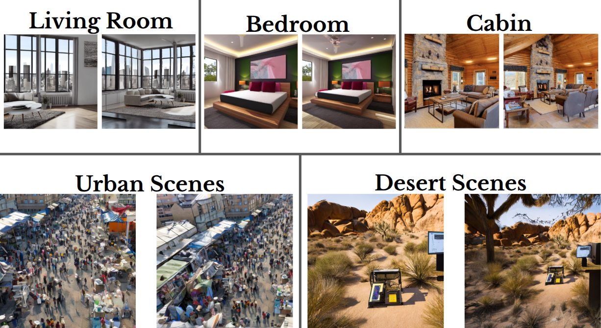

**Architecture:** *Showing how we created these worlds.*

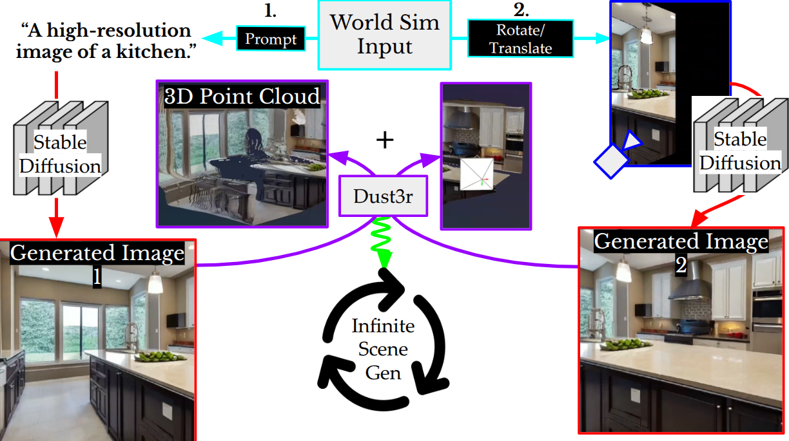

**Real-time Generation:** *A real-time recording of me creating a kitchen scene using Stable Diffusion and Dust3r.*

<p align="center">
  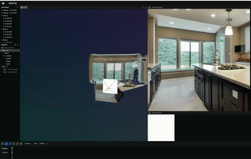
</p>

---

## A Few Scenes 
<table>
  <tr>
    <td align="center">
      <strong>LOTS of bay windows..</strong><br>
      
    </td>
    <td align="center">
      <strong>What happens in a long hallway?</strong><br>
      
    </td>
    <td align="center">
      <strong>Monastery tunnels</strong><br>
      
    </td>
  </tr>
  <tr>
    <td align="center">
      <strong>Full 360 beach views</strong><br>
      
    </td>
    <td align="center">
      <strong>Kitchen meets a fireplace</strong><br>
      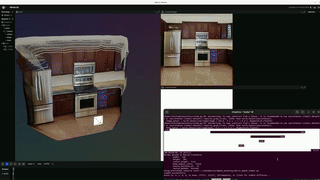
    </td>
    <td align="center">
      <strong>Nice wood oak paneling</strong><br>
      
    </td>
  </tr>
  <tr>
    <td align="center">
      <strong>Super mario kitchen-land</strong><br>
      
    </td>
    <td align="center">
      <strong>Severance hallway?</strong><br>
      
    </td>
    <td align="center">
      <strong>More beach and ocean views</strong><br>
      
    </td>
  </tr>
  <tr>
    <td align="center">
      <strong>Spacious bedroom kitchens</strong><br>
      
    </td>
    <td align="center">
      <strong>Fireplace bedroom kitchens</strong><br>
      
    </td>
    <td align="center">
      <strong>Interesting ceilings</strong><br>
      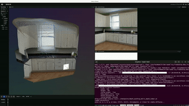
    </td>
  </tr>
</table>

## Synthetic Dataset 

<table>
  <tr>
    <td align="center">
      <strong>Urban spook</strong><br>
      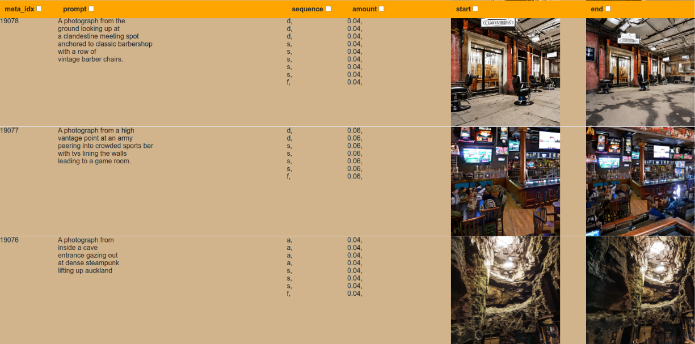
    </td>
    <td align="center">
      <strong>Mountains and ducks</strong><br>
      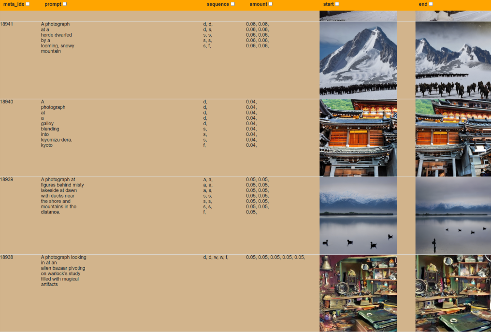
    </td>
  </tr>
  <tr>
    <td align="center">
      <strong>Marble, books, plants</strong><br>
      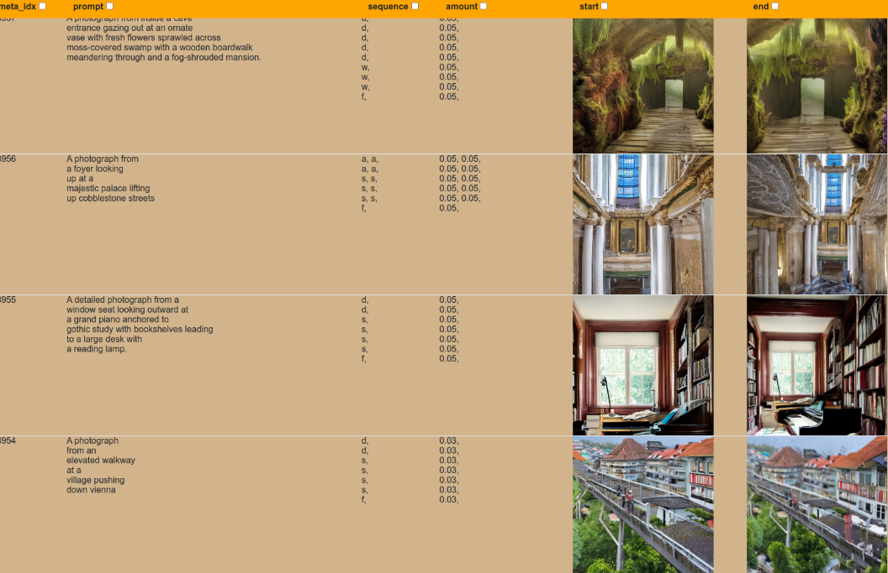
    </td>
    <td align="center">
      <strong>Buddha, cape town, aerial</strong><br>
      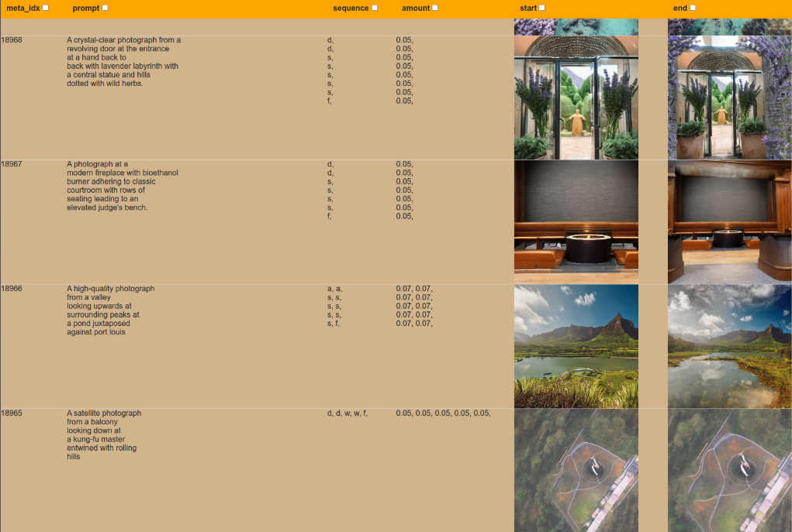
    </td>
  </tr>
  <tr>
    <td align="center">
      <strong>Venice and ruins</strong><br>
      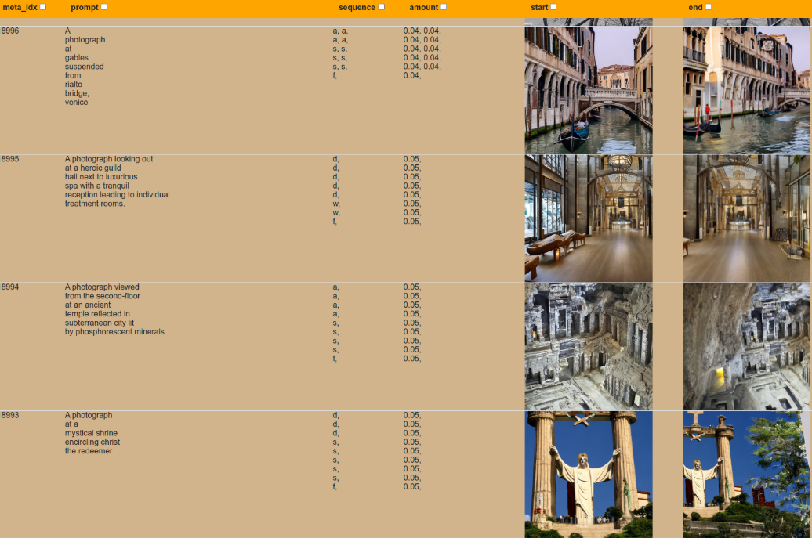
    </td>
    <td align="center">
      <strong>More kitchens</strong><br>
      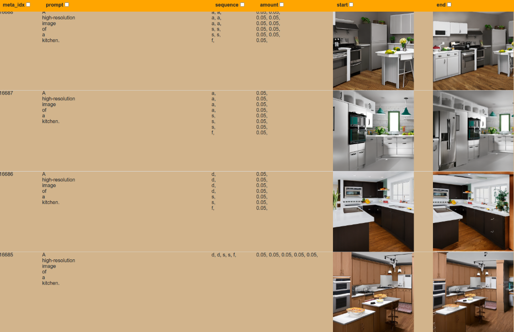
    </td>
  </tr>
</table>

## Install

### Quick Setup with VGGT

1. Create a conda environment:
```bash
mamba create -n myst python=3.10
mamba activate myst
```

2. Install VGGT and dependencies:
```bash
bash scripts/vggt_setup.sh
```

3. Install other dependencies:
```bash
mamba install -y pytorch torchvision torchaudio pytorch-cuda=12.1 diffusers xformers pytorch3d -c pytorch -c nvidia -c pytorch3d -c conda-forge
pip install -r requirements.txt
```

## Run

Default mode now uses VGGT for 3D reconstruction:
```bash
python run.py --depth vggt
```

You can also use other depth estimation methods:
- `--depth vggt` (default): VGGT - fastest and most accurate
- `--depth metric`: Metric3D
- `--depth da`: Depth Anything
- `--depth dust`: Dust3r/Mast3r (requires uncommenting imports in misc/three_d.py)

